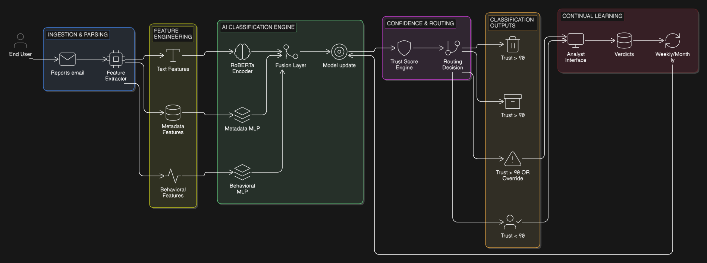

# Spam & Phishing Email Detection

An AI-based system to automatically classify user-reported emails and route them to one of four operational outcomes — **spam**, **junk**, **phishing**, and **analyst review** — to reduce manual triage effort for SOC analysts.

## Background

SOC analysts receive thousands of user-reported emails daily. Most are spam or bulk mail, not phishing. Since users aren't expected to tell the difference, everything lands in the analyst queue. This project introduces AI-based categorization to filter the noise and surface only the emails that genuinely need investigation.

## Goal

Reduce analyst false positive load by >50% and achieve >98% phishing recall, with accuracy improving over time through a feedback-driven continual learning pipeline.

## Design

The model is trained on **three semantic classes**: Spam, Junk, Phishing.

**Analyst Review is not a training class.** It is an operational routing state triggered at inference time when the model's confidence is insufficient to automate a decision. This keeps training data clean and makes confidence calibration reliable.

```
Model learns:     Spam | Junk | Phishing
Runtime outputs:  Spam | Junk | Phishing | Analyst Review
```

## Classification Output

Every reported email is routed to one of four operational outcomes:

| Outcome | Risk | SOC Action |
|---|---|---|
| Spam | Low | Auto-folder |
| Junk | Low–Medium | Junk route |
| Phishing | High | Immediate alert + full investigation |
| Analyst Review | Uncertain | Manual triage |

Each decision includes a calibrated 0–100 risk score and machine-readable reasoning.


## Quick Start

```bash
docker build -t email-triage .
docker run -p 8000:8000 email-triage
```

Open `http://localhost:8000` for the web UI, or use the API:

```bash
curl http://localhost:8000/health
curl -X POST http://localhost:8000/predict -F "file=@your_email.eml"
```

> First build takes ~5 minutes (downloads roberta-base). Subsequent builds are fast.

## Architecture


## Documentation

### Design
| Doc | Description |
|---|---|
| [Problem Statement](docs/design/problem-statement.md) | Full problem definition, objectives, and constraints |
| [AI System Design](docs/design/ai-solutions.md) | Model architecture, feature design, and implementation approach |
| [Classification Logic](docs/design/classification-logic.md) | Signal definitions, confidence scoring, and routing rules per class |
| [Confidence & Explainability](docs/design/confidence-and-explainability.md) | Trust score design, routing thresholds, attribution sources, and output schemas |
| [Project Structure](docs/design/project-structure.md) | Production folder structure and module responsibilities |

### Research
| Doc | Description |
|---|---|
| [Phishing Attack Types](docs/research/phishing-attacks.md) | Attack patterns this system detects and their signal characteristics |
| [Datasets](docs/research/datasets.md) | Public datasets used for training and validation |

### Implementation
| Doc | Description |
|---|---|
| [Dataset Construction Plan](docs/implementation/dataset/dataset-plan.md) | Full dataset sourcing, augmentation, feature extraction, and construction order |
| [Parallel Track Split](docs/implementation/dataset/dataset-parallel-tracks.md) | Track A / Track B work split, shared contract, and dependency map |
| [Track A Execution Plan](docs/implementation/dataset/track-a-execution-plan.md) | Step-by-step execution plan for Spam & Phishing class construction |
| [Track B Execution Plan](docs/implementation/dataset/track-b-execution-plan.md) | Step-by-step execution plan for Junk class construction and feature enrichment |
| [Track A Results](docs/implementation/dataset/track-a-results.md) | Complete execution record — commands, outputs, decisions, known limitations |
| [Track B Results](docs/implementation/dataset/track-b-results.md) | Complete execution record — commands, outputs, decisions, known limitations |
| [Dataset Preparation](docs/implementation/dataset/dataset-preparation-results.md) | Schema decisions, field enrichment, merge, split, and augmentation — execution record |
| [Serving Layer](docs/implementation/serving.md) | API endpoints, routing logic, running locally and with Docker |
| [Serving Results](docs/implementation/serving-results.md) | Model architecture, serving decisions, known limitations, files changed |

### Operations
| Doc | Description |
|---|---|
| [Feedback Loop](docs/operations/feedback-loop.md) | How analyst verdicts feed back into the model |
| [Evaluation Approach](docs/operations/evaluation-approach.md) | Metrics, baselines, and evaluation methodology |

## Status

Research and design phase complete. Dataset construction complete. Model trained (99.47% test accuracy). Serving layer complete — API running, Dockerized.

## License

[MIT](LICENSE)
