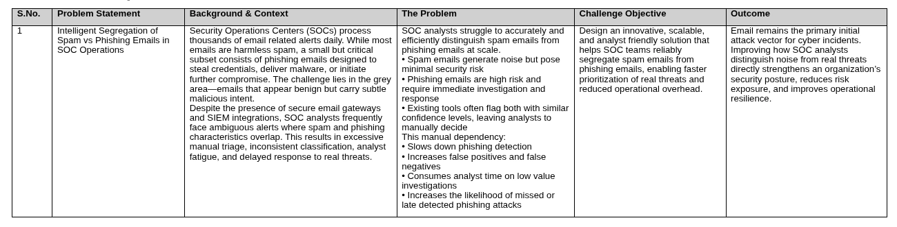

# Problem Statement: Intelligent Segregation of Spam vs Phishing Emails in SOC Operations

## Background

Security Operations Centers (SOCs) process thousands of email-related alerts daily. End users are encouraged to report any suspicious email — but they are not expected to distinguish between spam, junk, bulk, or phishing. This is by design.

The problem is that a significant portion of user-reported emails are actually spam, bulk marketing, or gray-area emails — not phishing. These still land in the SOC analyst's queue, creating noise that slows down response to real threats.

Existing secure email gateways and SIEM integrations flag both spam and phishing with similar confidence levels, leaving analysts to manually decide. This manual dependency:

- Slows down phishing detection and response
- Increases false positives and analyst fatigue
- Consumes analyst time on low-value investigations
- Raises the risk of missing or late-detecting actual phishing attacks

## The Core Problem

SOC analysts cannot efficiently and accurately distinguish spam from phishing at scale using current tooling. The grey area — emails that look benign but carry subtle malicious intent — is where the most analyst time is wasted and where real threats are most likely to be missed.

## What Users Report vs What It Actually Is

Users report anything that looks suspicious. In practice, reported emails fall into three categories:

| Category | Description | SOC Action Needed |
|---|---|---|
| Spam / Junk | Unsolicited bulk email, no malicious intent | None — auto-dismiss |
| Gray / Bulk | Marketing, newsletters, ambiguous bulk mail | Low — quick review |
| Phishing | Credential theft, malware delivery, BEC, social engineering | High — immediate investigation |

The current tooling does not make this distinction reliably, so everything flows to analysts.

## Objective

Design an AI-based categorization system that automatically segregates user-reported emails into the three buckets above, with a confidence score and a "manual review required" flag for borderline cases.

The goal is not perfection from day one. Even a **40–50% reduction in false positives** (spam/gray emails incorrectly escalated to analysts) is considered a meaningful and impactful outcome.

## Signals the System Should Use

The classification should not rely on a single signal. It must combine:

- **Email content and semantic intent** — urgency, impersonation, credential requests, tone
- **Sender–recipient relationship** — historical communication patterns, first-contact detection
- **Metadata and infrastructure signals** — sender domain age, IP reputation, SPF/DKIM/DMARC alignment
- **URL and attachment analysis** — suspicious links, redirect chains, malicious payloads
- **Behavioral patterns** — sending volume, time-of-day anomalies, header inconsistencies

## Constraints and Scope

- The solution starts as a **standalone prototype** — no SOC platform integration required initially
- Training and validation must use **publicly available datasets** (no proprietary or internet-scraped data)
- The system must support a **feedback loop** where analyst verdicts improve the model over time
- Future integration with SOC platforms (e.g., M365, SIEM/SOAR) is out of scope for the initial phase but should be architecturally considered

## Success Criteria

- 3-bucket classification output with confidence scores
- "Manual review required" flag for low-confidence or ambiguous cases
- Measurable reduction in false positives compared to baseline (existing tooling or manual triage)
- Feedback mechanism designed and documented, even if not fully automated in v1
